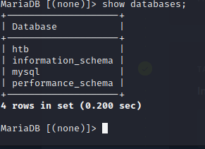
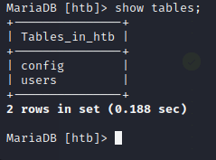
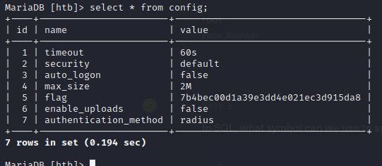

# Sequel(Linux)

- Se encontro que el puerto 3306 estaba abierto corriendo un servicio de mySQL
- Por lo que se procedio a ingresar por comando al servicio, donde ‘-h’ es el host, osea el ip de la maquina objetivo y ‘-u’ es el usuario (Se agrega root por que no solicita contraseña)

- Para ver las bases de datos del servidor, utilizamos el siguiente comando:
    
    
    
- En este caso nos interesa la llamada ‘hbt’, por lo que con el comando ‘use’ entramos en la base de datos

- Ya estando en la base de datos procedemos a ver las tablas que contiene para ver donde podria estar la flag
- Con la siguiente linea, se puede mostrar todo el contenido de cada tabla, para asi encontrar la flag
    
    
    

# Flag

7b4bec00d1a39e3dd4e021ec3d915da8