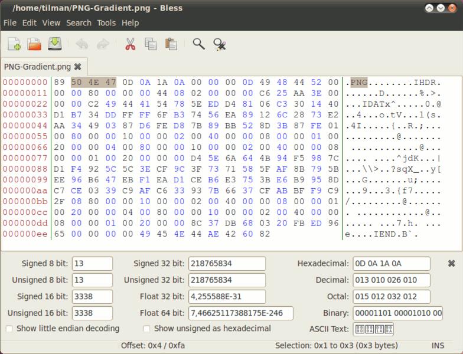
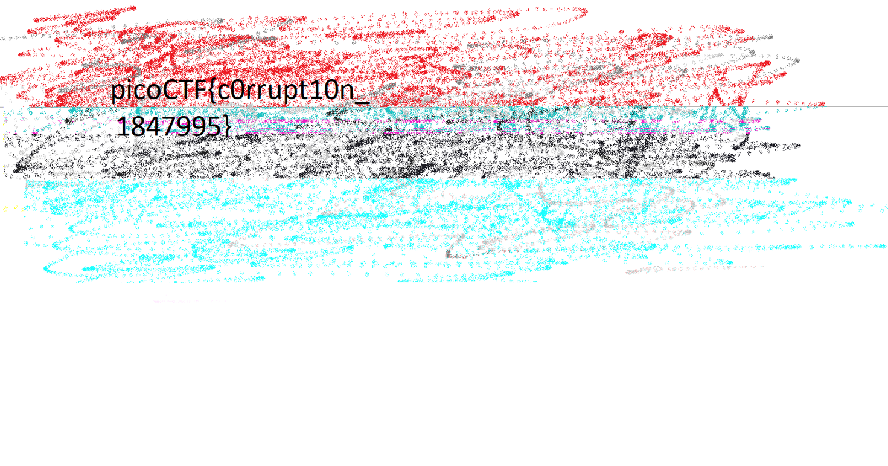

## Descripción
We found this [file](https://jupiter.challenges.picoctf.org/static/ab30fcb7d47364b4190a7d3d40edb551/mystery). Recover the flag.

## Pistas
- Try fixing the file header

## Solución
- La pista que se nos da es de gran ayuda para resolver el reto. Tenemos que modificar el encabazado del archivo a traves de un editor de hexadecimal, en este caso usare `HxD`.
- Ya estando dentro del editor hexadecimal con el archivo corrupto, tenemos que ver de que forma tiene el encabezado, en este caso tiene forma de un archivo `PNG`, por lo que renombraremos el archivo a `mystery.png`.
- Gracias a un archivo `.png` de referencia, pude ver que es lo que se le debe modificar al archivo corrupto para que vuelva a ser un archivo funcional.
- La foto de referencia es la siguiente:



- Con ayuda de esta imagen pude modificar todo el encabezado, que en la imagen es la primera fila.
- Despues de arreglar la imagen, la abrimos para ver la flag:



```bash()
picoCTF{c0rrupt10n_1847995}
```

## Notas adicionales
- Para darse cuenta de que archivo es hay que buscar referencias en google y enfocarse en los primeros 4 bits, ya que son los que dicen el tipo de formato del archivo

## Referencias 
- [imagen de referencia](https://commons.wikimedia.org/wiki/File:PNG-Gradient_hex.png)